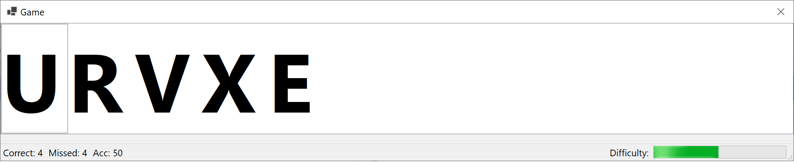

# Hra - procvičování psaní na klávesnici

Vytvořte desktopovou aplikaci (Windows Forms), která bude plnit funkci hry na procvičení psaní na klávesnici. Hra bude
generovat náhodně písmena, která se zobrazí v listboxu. Pokud hráč stiskne na klávesnici písmeno, které je
v seznamu (na prvním nebo libovolném místě), písmeno se smaže. Pokud dojde k zaplnění listboxu, hráč
prohrál. Postupně zvyšujte obtížnost. Zaznamenávejte statistiku, kolikrát se hráč trefil, netrefil a jaká je jeho
celková přesnost v procentech.

Možná další vylepšení:
* přidat Menu s položkami - Nová hra, About, Help, ...
* přidat Toolbar - dtto.
* Možnost nastavit režim hry - hráč musí vybrat první znak/libovolný znak.
* Režim slova - generována jsou celá slova (anglická/česká - z wordlistu), po stisku prvního znaku slova ho hráč musí napsat celé, 
  není možné napsat půl slova a pak pokračovat jiným. Slovo zmizí až po napsání celého slova.

## Postup

1. Formulář nastavte na vhodnou velikost (vizte screenshot)
    * Zakažte změnu velikosti - **FormBorderStyle** - **FixedSingle**
    * Zakažte maximalizaci a minimalizaci (**MaximizeBox** , **MinimizeBox**)
2. Vložte **ListBox** do formuláře
    * Pojmenujte jej jako _gameListBox_
    * Nastavte vlasnosti: **Dock** - **Fill** , **MultiColumn** - **True** , **Font** - tak, aby se na celou výšku vešlo jedno písmeno
3. Vložte **StatusStrip** do formuláře
    * Vložte do něj (vyberte **StatusStrip** a použijte zobrazené tlačítko) prvky **StatusLabel**
       (_correctLabel_ , _missedLabel_ , _accuracyLabel_ , _"Difficulty" label_) a progress bar (_difficultyProgressBar_).
    * U progress baru nastavte **Maximum** = **800**
    * U difficulty label nastavte **Spring** - **True** , **TextAlign** - **MiddleRight**
4. Vložte **Timer** do fomuláře (_gameTimer_)
    * Povolte ho (**Enabled** = **true**) a nastavte výchozí interval **800 ms**.
5. Dokončete třídu _Stats_ a související delegát pro událost (projekt _GameLibrary_)
6. Ve třídě formuláře vytvořte atributy _Random random_ a _Stats stats_. Inicializujte je.
    * V konstruktoru formuláře vytvořte (přidejte) handler pro událost **UpdatedStats** z objektu _stats_.
    * V metodě handleru aktualizujte hodnoty ve status baru (_correctLabel.Text_, _missedLabel.Text_, _accuracyLabel.Text_)
7. Vytvořte událost pro _gameTimer_ - **Tick**
    * Přidejte náhodné písmeno do _listboxu_ (_.Items.Add((Keys)random.Next(...)_). Přetypujte na
       **Keys** pro snažší zpracování při stisku klávesy.
    * Pokud je v _listboxu_ více než 6 položek - zastavte _timer_ , ukončete hru a vypište "Game over!" do _list boxu_.
8. Vytvořte událost pro _gameListBox_ - **KeyDown**
    * Zjistěte, jestli stisknutá klávesa (_e.KeyCode_) se nachází v list boxu (_.Items.Contains_).
    * Pokud ano, odeberte prvek a zavolejte nad _listboxem.Refresh()_
    * Zrychlete hru
       * Pokud interval časovače je > 400, snižte ho o 60
       * Interval > 250, snižte o 15
       * Interval > 150, snižte o 8
    * Vypočítejte obtížnost (pro progress bar - _.Value_) jako 800 - Interval časovače. Ošetřete
       přetečení a podtečení přes 800 nebo 0. Nastavte novou hodnotu do progress baru.
    * Aktualizujte statistiky (_stats.Update_, argument true, pokud se písmeno (stisknutá klávesa) nacházela v list boxu).
    * Pokud je hra ve stavu "Game over!", stisk libovolné klávesy obnoví list box, timer a statistiky do výchozího stavu a znovu spustí hru.
